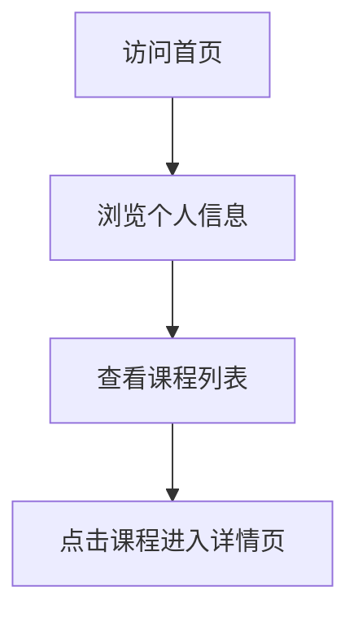

## 1. Product Overview
个人学习页面，用于展示广东科学技术职业学院商学院商务数据分析与应用专业学生陈琳婷的课程信息。
- 主要目的是提供一个静态页面，展示课程列表和相关信息，方便后续补充课程内容。
- 目标用户为学生本人、同学、教师等，展示学习成果和课程体系。

## 2. Core Features

### 2.1 User Roles
| 角色 | 注册方式 | 核心权限 |
|------|---------------------|------------------|
| 访问者 | 无需注册 | 浏览页面内容 |

### 2.2 Feature Module
1. **首页**：个人信息展示，课程列表，导航栏

### 2.3 Page Details
| 页面名称 | 模块名称 | 功能描述 |
|-----------|-------------|---------------------|
| 首页 | 个人信息区 | 展示学生姓名、学校、专业等基本信息 |
| 首页 | 课程列表 | 展示多门课程的基本信息，后续可点击进入详情页 |
| 首页 | 导航栏 | 提供页面导航功能，方便用户浏览 |

## 3. Core Process
用户访问首页 → 浏览个人信息 → 查看课程列表 → 后续可点击课程进入详情页

## 4. User Interface Design
### 4.1 Design Style
- 主色调：蓝色系 (#165DFF) 和白色 (#FFFFFF)
- 辅助色：浅灰色 (#F5F7FA) 和深灰色 (#333333)
- 按钮风格：圆角矩形，有 hover 效果
- 字体：无衬线字体，主标题 24px，副标题 18px，正文 14px
- 布局风格：卡片式布局，顶部导航，响应式设计
- 图标风格：简约线性图标

### 4.2 Page Design Overview
| 页面名称 | 模块名称 | UI 元素 |
|-----------|-------------|-------------|
| 首页 | 个人信息区 | 居中布局，包含头像、姓名、学校、专业等信息，使用卡片式设计，有轻微阴影效果 |
| 首页 | 课程列表 | 网格布局，每个课程为一个卡片，包含课程名称、简短描述，卡片有 hover 效果 |
| 首页 | 导航栏 | 顶部固定导航，包含页面标题和可能的其他导航链接 |

### 4.3 Responsiveness
- 采用桌面优先设计，同时支持移动设备自适应
- 在小屏幕设备上，课程列表从网格布局变为单列布局
- 导航栏在小屏幕上可折叠

### 4.4 3D Scene Guidance
- 无 3D 场景需求