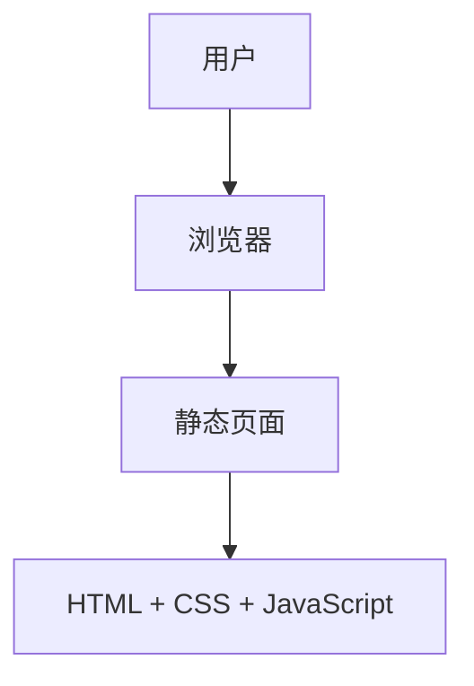

## 1. Architecture Design

## 2. Technology Description
- 前端：HTML5 + CSS3 + JavaScript + Tailwind CSS
- 构建工具：Vite
- 部署：Cloudflare Pages
- 无后端服务需求

## 3. Route Definitions
| 路由 | 用途 |
|-------|---------|
| / | 首页，展示个人信息和课程列表 |

## 4. API Definitions
- 无 API 需求，纯静态页面

## 5. Server Architecture Diagram
- 无服务器架构，纯静态部署

## 6. Data Model
- 无数据库需求，所有数据直接硬编码在页面中
- 课程数据结构：
  - 课程名称
  - 简短描述
  - 课程图标（可选）
  - 后续可扩展为详情页面链接